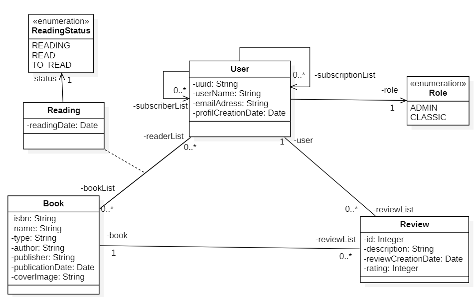

# LittleBook_Back
# 📘 Backend – Spring Boot 3 + Java 17 + SQL + Firebase

LittleBook est une application de type réseau social visant à permettre aux utilisateurs de partager du contenu, de suivre d'autres membres et d'interagir à travers des publications et commentaires.  
Ce dépôt correspond à la partie **back-end**, développée avec **Spring Boot**, assurant la gestion des utilisateurs, des rôles et des futures entités (posts, relations, etc.). Ce back sera en communication avec une partie **front-end** réalisé en parallèle avec **React**

---
## 👥 Équipe de développement

- **[AlyneLDC](https://github.com/alyneldc)** — Gestion de projet / Responsable backend / documentation
- **[MathBruu](https://github.com/mathbruu)** — Responsable frontend / intégration / documentation
- **[MouniaT](https://github.com/MOUNIAT-1002)** — Responsable backend / conception / intégration / documentation
- **[ThomasKsk](https://github.com/ThomasKsk)** — Base de données / documentation

---
## 📂 Sommaire

Ce dépôt contient :
- Le **code source du back-end en Java - Spring Boot**
- La **configuration de la base de données PostgreSQL (Supabase)**
- Les **scripts d’initialisation**
- Le **Dockerfile** pour le déploiement de l’API (en attente)

L’objectif de ce dépôt est d’offrir une base solide et évolutive avant le passage vers une **architecture orientée services (AOS)**.

---
## �️ Admin service (microservice)

Ce dépôt contient désormais une structure permettant d'extraire un microservice dédié **admin**. Les points clés :

- Entrypoint : `com.littlebook.admin.AdminApplication` (scan limité au package `com.littlebook.admin`).
- Port par défaut : `8081` (fichier `src/main/resources/application.yml`).
- Endpoints d'exemple : `/admin/health`, `/admin/ping`.
- Le code existant (controllers pour Book/Review/Subscription/User) reste présent pour archivage mais n'est plus scanné par l'application admin (pour éviter les conflits lors du démarrage).

Pour démarrer uniquement le microservice admin en local :

```bash
# compiler
mvn -pl . clean package -DskipTests

# lancer
mvn -pl . spring-boot:run -Dspring-boot.run.main-class=com.littlebook.admin.AdminApplication
```

Ou via Docker (build + run) :

```bash
docker build -t littlebook-admin:local .
docker run -p 8081:8081 littlebook-admin:local
```

Ce squelette est volontairement minimal — il fournit une base propre pour développer les features admin (gestion des utilisateurs, des rôles, monitoring, audits). Voir la section « TODO » en bas pour les étapes recommandées.

---
## �🚀 Stack technique

- [Java 17](https://www.oracle.com/java/technologies/javase/jdk17-archive-downloads.html) – LTS stable
- [Spring Boot 3.x](https://spring.io/projects/spring-boot) – framework backend
- [Lombok](https://projectlombok.org/) – simplification du code (getters, setters, constructeurs)
- [JUnit 5](https://junit.org/junit5/) – tests unitaires et d’intégration
- [Supabase](https://supabase.com) – base de données relationnelle (PostgreSQL)
- [Firebase](https://firebase.google.com/) – services cloud (authentification, notifications, storage…)
- [Open library](https://openlibrary.org/developers/api) - Récupération de l'ensemble des livres, genre, ...

---
## 📦 Installation

### 1. Cloner le projet
```bash
git clone https://github.com/MOUNIAT-1002/LittleBook_Back.git
cd LittleBook_Back
```

### 2. Activer les Git hooks (protection secrets)

**Une seule fois après le clone :**

```bash
# Sur Linux/Mac
./setup-hooks.sh

# Sur Windows (PowerShell)
.\setup-hooks.ps1
```
---
### 3. Setup développeur (Authentification Google via Firebase)

1. Demander la **clé de service** (fichier JSON) dans le coffre-fort d’équipe.
2. Placer le fichier en local, hors dépôt, p.ex.:
   - macOS/Linux: `~/littlebook/secrets/firebase-adminsdk.json`
   - Windows: `C:\Users\<you>\littlebook\secrets\firebase-adminsdk.json`
3. Exporter les variables d’environnement:
   - macOS/Linux:
     ```bash
     export FIREBASE_PROJECT_ID=littlebook-b2d2d
     export FIREBASE_CREDENTIALS=/ABSOLU/vers/secrets/firebase-sa.json
     ```
   - Windows (PowerShell):
     ```powershell
     $env:FIREBASE_PROJECT_ID = "littlebook-b2d2d"
     $env:FIREBASE_CREDENTIALS = "C:\<chemin>\secrets\firebase-sa.json"
     ```

## ⚙️ Compilation et execution 
### 1. Compilation
```bash
mvn clean install
```
### 2. Execution
```bash
mvn spring-boot:run
```
---
## 🧩 Implémentation actuelle

L’architecture actuelle suit une approche **monolithique** : toutes les fonctionnalités (utilisateurs, relations, posts, etc.) sont regroupées au sein d’une même API Spring Boot.

Cette approche permet un développement rapide et une meilleure cohérence initiale.  
À terme, l’objectif est de **découper l’application en microservices**, suivant une **architecture orientée services (AOS)** :
- Un service **User**
- Un service **Review**
- Un service **Suscriber / Suscribed**
- Un service **Notification**

---
## 🔮 Perspectives d’avenir

- Mise en place d’une **API Gateway** après le découpage complet en microservices  
- Création d’un **module de représentation graphique** basé sur les données utilisateurs  
- Ajout d’un **système d’envoi d’emails de notification** pour informer les utilisateurs de leurs réalisations  
- **Déploiement complet avec Docker** et orchestration des services  
- **Ouverture du projet en open-source** pour favoriser la contribution communautaire  
- Mise en place d’une **authentification avancée** (JWT / OAuth2) 

---
## 🧩 Modèle de donnée


---
## 🌐 Déploiement

L’API est actuellement en cours de réalisation et n'est pas encore accessible au public.

Lien du dépot github : 
👉 https://github.com/LittleBook-Project/LittleBook_Back/
Lien de production :
👉 **En attente de la fin complète du projet**
